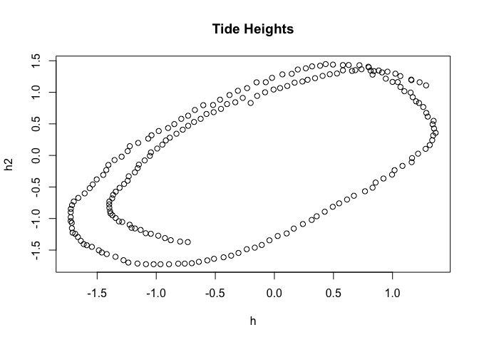
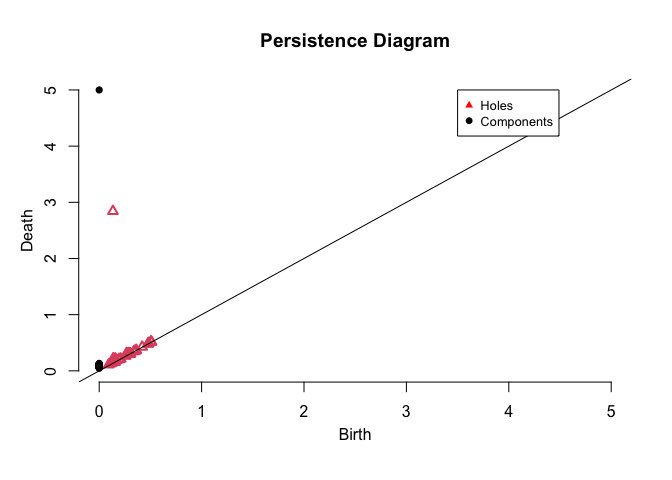
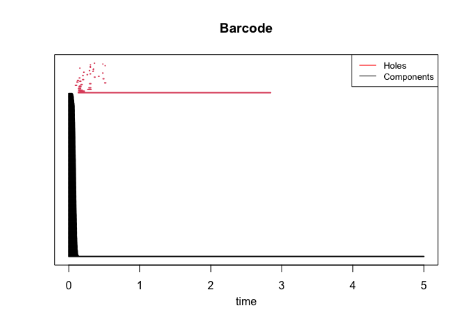

# The shape of tides (Topological Data Analysis)

The goal of this project is to analyse tide times in Galway and try to
extract some information on the periodicity of tide times. We’ll use
methods from an area of maths called topology.

We first load the R-TDA package

    #install.packages('TDA')
    library(TDA)

We will now read tide times from 15/03-29/03.

    tides <- read.csv(file="/Users/jamesmcgloin/Documents/CodingProjects/The-Shape-of-Tides/galwaytides.csv", nrows=3411, header=FALSE)
    height <- tides[,8]

We now create an index to sample 200 values from our tide times

    index = seq(1,200)

We create three vectors the first containing tide times at time
*t*0 the second containing values at
*t*0 + 2*h**r**s* and the third at *t* + 4*h**r**s* .

    h <- c()  # heights
    h2 <- c() # heights at t + 2h
    h4 <- c() # heights at t + 4h
    for (i in index) {
      h  <- append(h,  height[i])
      h2 <- append(h2, height[i+20])
      h4 <- append(h4, height[i+40])
    }

We know create a data frame consisting of 3 columns corresponding to
*h*, *h*2 and *h*4 and create a 3*D* plot of the
data

    #install.packages("plotly")
    library(plotly)

    ## Loading required package: ggplot2

    ## 
    ## Attaching package: 'plotly'

    ## The following object is masked from 'package:ggplot2':
    ## 
    ##     last_plot

    ## The following object is masked from 'package:stats':
    ## 
    ##     filter

    ## The following object is masked from 'package:graphics':
    ## 
    ##     layout

    data = data.frame(h,h2,h4)
    #fig <-plot_ly(data = data, x=~h, y=~h2, z=~h4, type="scatter3d", mode="markers")%>%
            #layout(title = 'Tide Heights', plot_bgcolor = "#e5ecf6")
    #fig
    plot(h,h2, title("Tide Heights"))

We can see clearly from this plot that there is some periodic motion
going on in our data. We’ll now look at a way of extracting this info
using topological data analysis.

We create our Vietoris Rips complex using the ripsDiag() function. I’l
set max dimension as 1 as I won’t be considering persistence in the
second homology group or above. In fact this would be ineffecient to
calculate and, at least in *H*2, we don’t detect any
interesting features (I didn’t bother computing for higher homology
groups but I suspect a similar result ).

I’ll set max scale to 5 as this turns out to be an appropriate scale for
our data and I’ll use the standard Eulidean distance as our metric.

    maxdimension <- 1
    maxscale <- 5
    Diag <- ripsDiag(X = data.frame(h,h2,h4),
                     maxdimension,
                     maxscale,
                     dist = "euclidean",
                     library = "GUDHI",
                     printProgress = FALSE)

Now we plot a persistence diagram of our data

    #print(Diag[["diagram"]])
    plot(Diag[["diagram"]], barcode=FALSE,  main = "Persistence Diagram")
    legend(3.5, 5, legend=c("Holes", "Components"),
           col=c("red", "black"), cex=0.8, pch = c(17,19))

The red triangles in our diagrams correspond to birth/death times of
“holes” and the black dots correspond to birth/death times of connected
components

And finally we output a barcode of persisting features in
*H*0 and *H*1.

    plot(Diag[["diagram"]], barcode=TRUE,  main = "Barcode")
    legend("topright", legend=c("Holes", "Components"),
           col=c("red", "black"), cex=0.8, lty= 1:1)

## Conclusion

We see from both the persistence diagram and the bar code that there is
persistence in the second homology group, i.e. there is a 1-dimensional
hole in our data.

This is exactly what we should expect with the motion of the tide!
Really the hole that we are picking up on is that of the moon orbiting
the earth which in my opinion is pretty neat.
